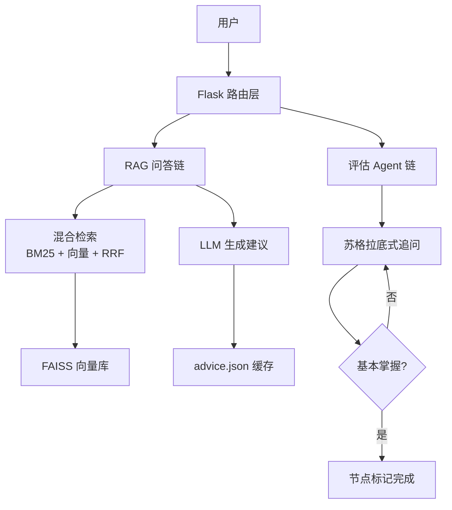

# Personal Learning Agent
## 中文

### 项目简介
Personal Learning Agent 是一个基于 RAG 与 LangGraph 思路构建的个人学习追踪系统。它通过技能树可视化学习路径，让每个知识点的依赖关系和进度状态清晰可见。系统引入苏格拉底式追问评估，检验是否真正掌握，而不是只做被动打卡。它还会结合个人学习记录进行检索，生成更有针对性的学习建议。

## 系统架构


### 功能特性
- **技能树地图**
  - 用依赖连线展示学习路径
  - 支持三种节点状态：`completed`、`active`、`locked`
- **节点评估**
  - 面向单一知识点的追问式评估
  - 通过后可将节点标记为完成
- **学习追踪**
  - 时间轴记录学习里程碑
  - 学习记录持久化存储
- **RAG 检索建议**
  - 建议基于个人学习记录生成，而非泛化回答
- **建议持久化**
  - 每个节点建议自动缓存并复用
  - 需要时可手动“重新生成”

### 技术栈
- Python
- Flask
- LangChain
- FAISS
- OpenAI 兼容 API

### 快速开始
1. **克隆项目**
   ```bash
   git clone <your-repo-url>
   cd agent-learning
   ```

2. **创建并激活虚拟环境**
   ```bash
   python -m venv .venv
   # Windows PowerShell
   .\.venv\Scripts\Activate.ps1
   ```

3. **安装依赖**
   ```bash
   pip install flask langchain-openai faiss-cpu numpy
   ```

4. **配置 API Key**
   - 打开 `learning_tracker.py`
   - 配置 OpenAI 兼容接口的：
     - 大模型 API 信息（如 OpenRouter 风格 endpoint）
     - Embedding API 信息

5. **启动项目**
   ```bash
   python app.py
   ```
   浏览器访问 `http://127.0.0.1:5000`。

### 项目结构
- `app.py`  
  Flask 入口与路由层（`/map`、`/tracker`、`/chat`、`/evaluate`、建议持久化接口）。
- `learning_tracker.py`  
  个人记忆 Agent 核心逻辑：embedding、FAISS 检索与回答生成。
- `templates/map.html`  
  技能树页面、节点详情面板、评估窗口与建议交互。
- `templates/index.html`  
  学习追踪工作台（聊天 + 时间轴管理）。
- `learning_db/`  
  向量索引与元数据持久化目录（`vector_index.faiss`、`metadata.json`）。
- `advice.json`  
  节点级学习建议缓存文件。
- `test.py`  
  本地测试与快速实验脚本。

### 页面显示
路线图


学习建议（建议结果可保存）


过程记录


---

## English

### Project Overview
Personal Learning Agent is a personal learning tracking system built with RAG and LangGraph-oriented agent workflow design. It visualizes learning progress as a skill tree, so each topic can be tracked with clear dependency relationships. It also adds Socratic-style evaluation to test real understanding instead of passive completion. The system combines memory retrieval and targeted guidance generation based on personal study history.

### Features
- **Skill Tree Map**
  - Visual learning path with dependency lines
  - Three node states: `completed`, `active`, `locked`
- **Node Evaluation**
  - Socratic, follow-up interview style assessment per knowledge point
  - Supports marking a node as completed after passing evaluation
- **Learning Tracker**
  - Timeline-based milestone records
  - Persistent local storage for study history
- **RAG Retrieval**
  - Suggestions are generated from your own learning records, not generic advice
- **Advice Persistence**
  - Node-specific suggestions are auto-saved and reused
  - Regeneration is available only when needed

### Tech Stack
- Python
- Flask
- LangChain
- FAISS
- OpenAI-compatible API

### Quick Start
1. **Clone the project**
   ```bash
   git clone <your-repo-url>
   cd agent-learning
   ```

2. **Create and activate a virtual environment**
   ```bash
   python -m venv .venv
   # Windows PowerShell
   .\.venv\Scripts\Activate.ps1
   ```

3. **Install dependencies**
   ```bash
   pip install flask langchain-openai faiss-cpu numpy
   ```

4. **Configure API keys**
   - Open `learning_tracker.py`
   - Set your OpenAI-compatible keys for:
     - LLM provider (OpenRouter-style endpoint)
     - Embedding provider

5. **Run the app**
   ```bash
   python app.py
   ```
   Then open `http://127.0.0.1:5000`.

### Project Structure
- `app.py`  
  Flask entry point and route layer (`/map`, `/tracker`, `/chat`, `/evaluate`, advice persistence APIs).
- `learning_tracker.py`  
  Core personal memory agent logic: embedding, FAISS retrieval, and response generation.
- `templates/map.html`  
  Skill tree visualization, node detail panel, evaluation UI, and suggestion interaction.
- `templates/index.html`  
  Tracker workspace with chat + timeline record management.
- `learning_db/`  
  Persistent vector index and metadata (`vector_index.faiss`, `metadata.json`).
- `advice.json`  
  Cached node-level learning suggestions.
- `test.py`  
  Local testing script for quick experiments.

### Development Background
I built this project on my fourth day of learning Agent development. Starting from zero, I spent four days moving from basic LLM API calls to a complete, working Agent application. This system itself is built with the techniques I learned during that process, and it directly records and reflects my own learning journey.


