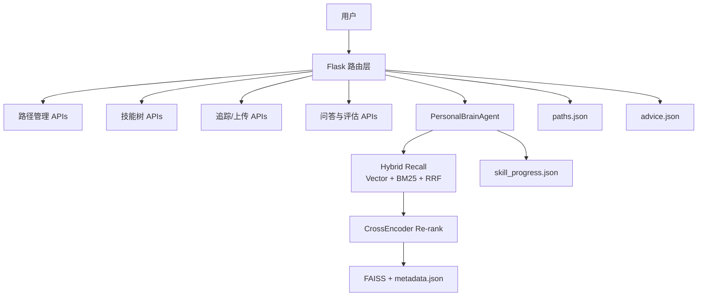
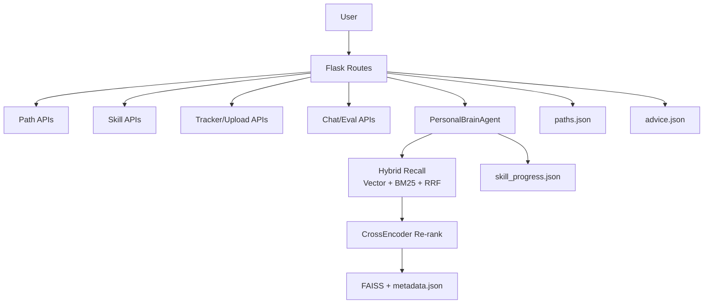

# LearnFlow

## 中文

### 项目简介
LearnFlow 是一个面向 Agent 学习场景的个人学习系统。当前版本已经形成“学习路径管理 + 学习记录沉淀 + 检索问答 + 节点评估”的闭环，重点不是单次对话，而是持续推进技能掌握状态。

核心定位：
- 用路径和节点管理学习目标，而不是只做文档问答
- 用混合检索和重排提升回答与个人记录的相关性
- 用追问式评估判断节点是否达到“基本掌握”
- 用持久化数据支持长期复盘与迭代

### 当前实现架构


### 功能总览（按模块）
1. 路径与技能树
- 支持 AI 生成学习路径：`POST /generate_path`
- 支持保存/读取路径：`POST /save_path`、`GET /get_paths`、`GET /get_path/<path_id>`
- 支持节点状态更新：`POST /update_node_status`
- 支持技能树渲染视图：`GET /skills/tree`

2. 学习咨询、建议与评估
- 学习咨询：`POST /skills/consult`
- 节点建议（含缓存）：`POST /skills/advice`、`POST /save_advice`、`GET /get_advice`
- 节点评估（追问式）：`POST /skills/evaluate`、`POST /evaluate`
- 手动标记完成：`POST /skills/complete`

3. 学习追踪与知识库
- 添加记录：`POST /add`
- 时间线查看：`GET /timeline`
- 删除记录：`DELETE /record`
- 文档上传入库（文本/PDF）：`POST /upload`

4. 问答与检索
- 普通问答：`POST /chat`
- 流式问答（SSE）：`POST /chat_stream`
- 检索质量快速评估：`GET /search_eval`

### 检索与评估策略
- 检索链路：向量召回 + BM25 + RRF 融合 + CrossEncoder 重排
- 文档处理：文本切分（chunk）后向量化入库
- 评估机制：规则分与 LLM 分结合，输出 `passed` 和分数细项
- 学习状态：节点会根据证据数、评估结果更新掌握度

### 页面路由
- 首页：`/`（重定向到 `/landing`）
- 路径地图：`/map`
- 学习追踪台：`/tracker`
- 学习咨询页：`/consult`
- 其他页面：`/landing`、`/bubble`

### 技术栈
- Python
- Flask
- LangChain（`langchain-openai`, `langchain-text-splitters`）
- FAISS（`faiss-cpu`）
- Sentence Transformers（CrossEncoder 重排）
- OpenAI SDK（流式对话）
- PyMuPDF（PDF 解析）
- NumPy
- python-dotenv

### 数据文件说明
- `learning_db/vector_index.faiss`：向量索引
- `learning_db/metadata.json`：学习记录元数据
- `learning_db/skill_progress.json`：节点掌握状态与评估结果
- `paths.json`：学习路径数据
- `advice.json`：建议缓存
- `skill_tree_agent.json`：默认技能树定义

### 快速开始（Windows PowerShell）
1. 克隆项目
```bash
git clone <your-repo-url>
cd agent-learning
```

2. 创建并激活虚拟环境
```bash
python -m venv .venv
.\.venv\Scripts\Activate.ps1
```

3. 安装依赖
```bash
pip install flask openai python-dotenv langchain-openai langchain-text-splitters faiss-cpu numpy sentence-transformers pymupdf
```

4. 配置环境变量
- 复制 `.env.example` 为 `.env`
- 至少配置：
  - `OPENROUTER_API_KEY`
  - `SILICONFLOW_API_KEY`

5. 启动服务
```bash
python app.py
```
浏览器打开 `http://127.0.0.1:5000`。

### 目录结构
- `app.py`：Flask 入口与全部路由
- `learning_tracker.py`：RAG、混合检索、评估、进度逻辑
- `templates/`：前端页面（`landing`、`map`、`tracker`、`consult`、`bubble`）
- `static/`：样式资源
- `learning_db/`：向量库与学习数据

---

## English

### Overview
LearnFlow is a Flask-based learning system for Agent skill development. The current version provides a full loop of path planning, progress tracking, retrieval QA, and node-level evaluation.

Core positioning:
- Goal-oriented learning paths instead of pure document QA
- Hybrid retrieval + reranking grounded in personal records
- Socratic node evaluation to decide mastery status
- Persistent storage for long-term learning iteration

### Architecture (current implementation)


### Feature Modules
1. Path and skill tree
- AI path generation: `POST /generate_path`
- Path persistence and query: `POST /save_path`, `GET /get_paths`, `GET /get_path/<path_id>`
- Node status update: `POST /update_node_status`
- Skill tree view: `GET /skills/tree`

2. Consult, advice, and evaluation
- Learning consult: `POST /skills/consult`
- Node advice with cache: `POST /skills/advice`, `POST /save_advice`, `GET /get_advice`
- Node evaluation loop: `POST /skills/evaluate`, `POST /evaluate`
- Manual completion: `POST /skills/complete`

3. Tracker and knowledge base
- Add records: `POST /add`
- Timeline list: `GET /timeline`
- Delete records: `DELETE /record`
- Text/PDF ingestion: `POST /upload`

4. QA and retrieval
- QA: `POST /chat`
- Streaming QA (SSE): `POST /chat_stream`
- Retrieval quick eval: `GET /search_eval`

### Retrieval and Evaluation Strategy
- Retrieval pipeline: Vector + BM25 + RRF fusion + CrossEncoder reranking
- Ingestion: chunking before vectorization
- Evaluation: hybrid rule score + LLM score with pass/fail output
- Progress: node confidence updated by evidence and evaluation results

### Web Pages
- Home: `/` (redirects to `/landing`)
- Map: `/map`
- Tracker: `/tracker`
- Consult: `/consult`
- Other pages: `/landing`, `/bubble`

### Tech Stack
- Python, Flask
- LangChain (`langchain-openai`, `langchain-text-splitters`)
- FAISS (`faiss-cpu`)
- Sentence Transformers (CrossEncoder)
- OpenAI SDK
- PyMuPDF
- NumPy
- python-dotenv

### Data Files
- `learning_db/vector_index.faiss`
- `learning_db/metadata.json`
- `learning_db/skill_progress.json`
- `paths.json`
- `advice.json`
- `skill_tree_agent.json`

### Quick Start
1. Clone
```bash
git clone <your-repo-url>
cd agent-learning
```

2. Create venv
```bash
python -m venv .venv
.\.venv\Scripts\Activate.ps1
```

3. Install dependencies
```bash
pip install flask openai python-dotenv langchain-openai langchain-text-splitters faiss-cpu numpy sentence-transformers pymupdf
```

4. Configure environment variables
- Copy `.env.example` to `.env`
- Required keys:
  - `OPENROUTER_API_KEY`
  - `SILICONFLOW_API_KEY`

5. Run
```bash
python app.py
```
Open `http://127.0.0.1:5000`.


