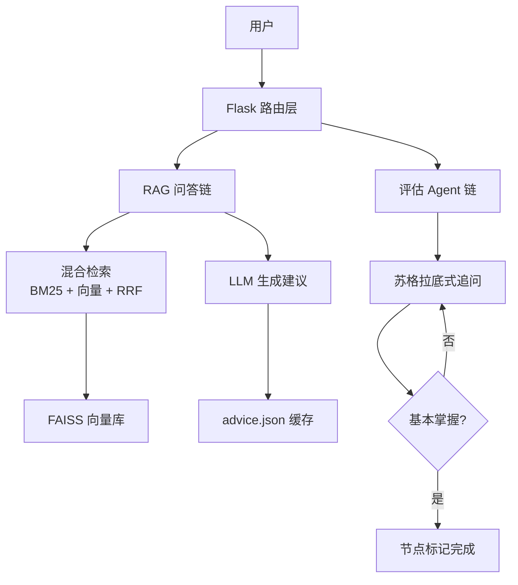
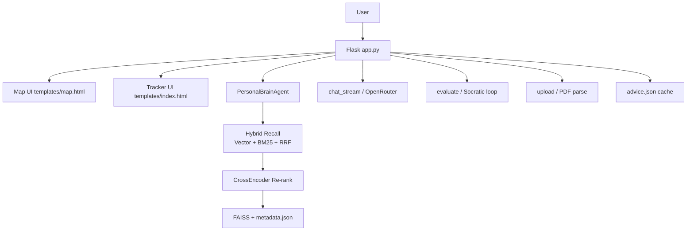

# Personal Learning Agent

## 中文

### 项目简介
Personal Learning Agent 是一个以 Flask + RAG 为核心的个人学习追踪系统。项目把你的学习过程拆成「技能树 + 时间轴 + 检索问答 + 节点评估」四个协同模块：  
- 在技能树里查看当前阶段与后续路径  
- 在追踪页持续记录学习内容并上传文本 / PDF 资料  
- 通过混合检索（向量 + BM25 + RRF）和重排得到更贴合个人历史的回答  
- 通过追问式评估判断某个知识点是否达到“基本掌握”

### 当前代码架构


### 核心功能（对应现有代码）
- 技能树地图：节点状态为 `completed` / `active` / `locked`，支持节点详情、建议获取、评估入口
- 学习追踪工作台：聊天窗口 + 时间轴管理 + 新增/删除学习记录
- 流式问答：`/chat_stream` 使用 SSE 逐字返回回答
- 文档入库：`/upload` 支持文本与 PDF 上传，自动切分 chunk 后写入向量库
- 检索增强：先分集合召回，再做 CrossEncoder 重排，降低泛化回答
- 节点评估：`/evaluate` 按节点进行 2~4 轮追问，返回是否 `[基本掌握]`
- 建议缓存：`/save_advice` 与 `/get_advice` 将节点建议持久化到 `advice.json`
- 检索评估：`/search_eval` 提供 Precision@3 的快速检查接口

### 技术栈
- Python
- Flask
- LangChain (`langchain-openai`)
- FAISS (`faiss-cpu`)
- Sentence Transformers（CrossEncoder 重排）
- OpenAI SDK（用于流式聊天）
- PyMuPDF（PDF 解析）
- python-dotenv

### 快速开始（Windows PowerShell）
1. **克隆项目**
   ```bash
   git clone <your-repo-url>
   cd agent-learning
   ```

2. **创建并激活虚拟环境**
   ```bash
   python -m venv .venv
   .\.venv\Scripts\Activate.ps1
   ```

3. **安装依赖**
   ```bash
   pip install flask openai python-dotenv langchain-openai langchain-text-splitters faiss-cpu numpy sentence-transformers pymupdf
   ```

4. **配置环境变量**
   - 复制 `.env.example` 为 `.env`
   - 至少配置以下键：
     - `OPENROUTER_API_KEY`（LLM 调用）
     - `SILICONFLOW_API_KEY`（Embedding 调用）

5. **启动项目**
   ```bash
   python app.py
   ```
   打开 `http://127.0.0.1:5000`。

### 主要路由
- 页面：`/`、`/map`、`/tracker`
- 问答：`POST /chat`、`POST /chat_stream`
- 评估：`POST /evaluate`、`GET /search_eval`
- 记录管理：`GET /timeline`、`POST /add`、`DELETE /record`
- 文档入库：`POST /upload`
- 建议缓存：`POST /save_advice`、`GET /get_advice`

### 项目结构
- `app.py`：Flask 入口、路由聚合、SSE 流式响应、PDF 提取、建议缓存读写
- `learning_tracker.py`：检索与记忆核心（chunking、向量化、BM25、RRF、重排、评估）
- `templates/map.html`：技能树与节点评估交互
- `templates/index.html`：聊天 + 时间轴 + 上传入口
- `learning_db/`：FAISS 索引和 `metadata.json` 持久化数据
- `advice.json`：节点建议缓存
- `eval_retrieval.py`：离线检索评估脚本
- `test.py`：OpenRouter API 连通性测试
- `start_try/`：早期实验脚本（不参与主流程）

### 页面示例
路线图


学习建议（建议结果可保存）


过程记录


---

## English

### Overview
Personal Learning Agent is a Flask-based personal learning tracker built around RAG. It combines four connected modules: skill map, timeline tracking, retrieval-based QA, and node-level Socratic evaluation.

### Architecture (as implemented)


### Features
- Skill tree with three states: `completed`, `active`, `locked`
- Tracker workspace with chat, timeline add/delete, and uploads
- Streaming answer endpoint via SSE: `POST /chat_stream`
- Text/PDF ingestion endpoint: `POST /upload` with chunking + vector storage
- Hybrid retrieval pipeline: vector + BM25 + RRF, then CrossEncoder reranking
- Node evaluation loop (`POST /evaluate`) with pass signal `[基本掌握]`
- Persistent advice cache via `advice.json`
- Retrieval quality quick check endpoint: `GET /search_eval`

### Tech Stack
- Python, Flask
- LangChain (`langchain-openai`, `langchain-text-splitters`)
- FAISS (`faiss-cpu`)
- Sentence Transformers (CrossEncoder)
- OpenAI SDK
- PyMuPDF
- python-dotenv

### Quick Start
1. **Clone**
   ```bash
   git clone <your-repo-url>
   cd agent-learning
   ```

2. **Create venv**
   ```bash
   python -m venv .venv
   .\.venv\Scripts\Activate.ps1
   ```

3. **Install dependencies**
   ```bash
   pip install flask openai python-dotenv langchain-openai langchain-text-splitters faiss-cpu numpy sentence-transformers pymupdf
   ```

4. **Set environment variables**
   - Copy `.env.example` to `.env`
   - Required keys:
     - `OPENROUTER_API_KEY`
     - `SILICONFLOW_API_KEY`

5. **Run**
   ```bash
   python app.py
   ```
   Open `http://127.0.0.1:5000`.

### Main Routes
- Pages: `/`, `/map`, `/tracker`
- Chat: `POST /chat`, `POST /chat_stream`
- Evaluation: `POST /evaluate`, `GET /search_eval`
- Timeline: `GET /timeline`, `POST /add`, `DELETE /record`
- Upload: `POST /upload`
- Advice cache: `POST /save_advice`, `GET /get_advice`

### Project Structure
- `app.py`: Flask entry, routes, streaming response, PDF extraction, advice cache IO
- `learning_tracker.py`: chunking, embedding, hybrid search, reranking, QA and eval
- `templates/map.html`: skill map and node evaluation UI
- `templates/index.html`: chat + timeline + upload UI
- `learning_db/`: persistent `vector_index.faiss` and `metadata.json`
- `advice.json`: node-level advice cache
- `eval_retrieval.py`: offline retrieval evaluation script
- `test.py`: OpenRouter API connectivity test
- `start_try/`: early-stage experiment scripts (not used in main runtime)


